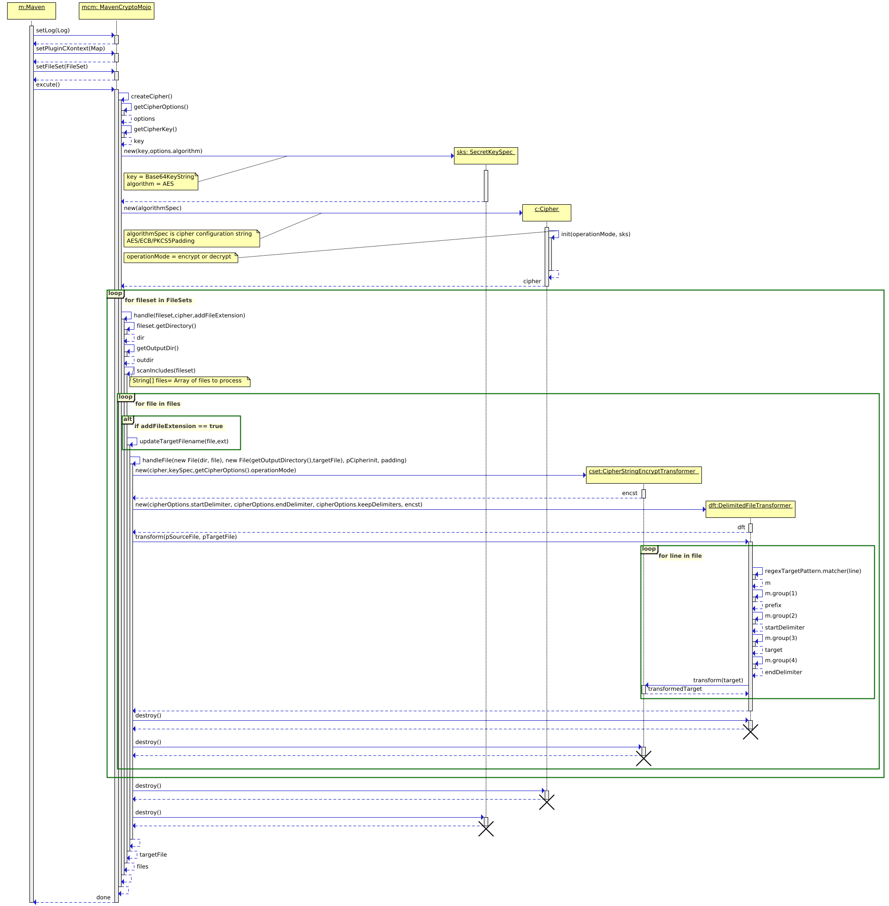

Maven Delimiter Crypto Plugin
==================================

The plugin *crypto-delimiter-maven-plugin* lets you encrypt and decrypt source text files within start and end delimiters.

Note: encrypted text is base64 encoded to allow ediing with text editor


Overview
--------------------


1) create a maven project with pom.xml indicating files to encrypt via filesets and cipherOptions

```xml
<project>
  <build>
   <defaultGoal>org.osa:crypto-delimiter-maven-plugin:crypto</defaultGoal>
    <plugins>
      <plugin>
        <groupId>org.osa</groupId>
        <artifactId>crypto-delimiter-maven-plugin</artifactId>
        <version>0.4-SNAPSHOT</version>
        <configuration>
          <fileSets>
            <fileSet>
              <directory>src/test/example</directory>
              <!--<outputDirectory>/</outputDirectory> -->
              <include>*.properties</include>
            </fileSet>
          </fileSets>
          <cipherOptions>
            <operationMode>encrypt</operationMode>
            <algorithm>AES</algorithm>
            <algorithmMode>ECB</algorithmMode>
            <algorithmPadding>PKCS5Padding</algorithmPadding>
            <secret>4IGGEPu/81QQxC62yOuFoQ==</secret>
            <startDelimiter>ENC(</startDelimiter>
            <endDelimiter>)</endDelimiter>
            <keepDelimiters>true</keepDelimiters>
          </cipherOptions>
        </configuration>
      </plugin>
    </plugins>
  </build>
</project>
```

see wikipedia Base64 specification: <https://en.wikipedia.org/wiki/Base64>

see src/it/encrypt and src/it/decrypt for examples within source code

Development
-----------

* Build the plugin

    mvn clean install

  Make sure you got [Maven 3.2.1+][maven_download] or higher.

* Build the site (and the optional example report)

    mvn clean install integration-test site -Psite

    mvn site:deploy -Psite,dist-labs

* Release

    mvn release:prepare

    mvn release:perform

* Sample projects under the it directory encrypt

Simply copy the `encrypt` sub-directory within the `it` directory where **encrypt** is a self contained example maven project using this plugin.

**Note:** You must run `mvn install` from the top level of the crypto-delimiter-maven-plugin project locally to build and install the plugin in your local maven repository often located within the `$HOME/.m2` directory before running the example projects such as encrypt.

```txt
$ mvn --debug

Apache Maven 3.3.9 (bb52d8502b132ec0a5a3f4c09453c07478323dc5; 2015-11-10T11:41:47-05:00)
Maven home: /home/lt/.sdkman/candidates/maven/current
Java version: 1.8.0_242, vendor: Oracle Corporation
Java home: /home/lt/.sdkman/candidates/java/8.0.242-open/jre
Default locale: en_CA, platform encoding: UTF-8
OS name: "linux", version: "5.3.0-51-generic", arch: "amd64", family: "unix"

...output removed...

[DEBUG] Configuring mojo 'org.osa:crypto-delimiter-maven-plugin:0.4-SNAPSHOT:crypto' with basic configurator -->
[DEBUG]   (f) addFileExtension = true
[DEBUG]   (f) operationMode = encrypt
[DEBUG]   (f) algorithm = AES
[DEBUG]   (f) algorithmMode = ECB
[DEBUG]   (f) algorithmPadding = PKCS5Padding
[DEBUG]   (f) secret = 4IGGEPu/81QQxC62yOuFoQ==
[DEBUG]   (f) startDelimiter = ENC(
[DEBUG]   (f) endDelimiter = )
[DEBUG]   (f) keepDelimiters = true
[DEBUG]   (f) cipherOptions = org.osa.MavenCryptoMojo$CipherOptions@6c2d4cc6
[DEBUG]   (s) directory = src/test/example
[DEBUG]   (s) include = *.properties
[DEBUG]   (f) fileSets = [FileSet {directory: src/test/example, PatternSet [includes: {*.properties}, excludes: {}]}]
[DEBUG]   (f) outputDirectory = /media/lt/xenial_build/java1/crypto-delimiter-test/encrypt/target
[DEBUG] -- end configuration --
[DEBUG] Decoded Base64 key
[DEBUG] Using algorithm AES/ECB/PKCS5Padding
[INFO] Directory [/media/lt/xenial_build/java1/crypto-delimiter-test/encrypt/target] does not exist attempting to create
[DEBUG] Crypting src/test/example/foo.properties to /media/lt/xenial_build/java1/crypto-delimiter-test/encrypt/target/foo.properties.AES
[DEBUG] regex match:[(.*)(\QENC(\E)([a-zA-Z0-9=+/]+)(\Q)\E)]
[DEBUG] line[2] match[encryptedproperty2=:ENC(:password2:)]
[DEBUG] line[3] match[property3=:ENC(:value3:)]
[INFO] Encrypted foo.properties to foo.properties.AES .................. [57ms]
[INFO] ------------------------------------------------------------------------
[INFO] BUILD SUCCESS
[INFO] ------------------------------------------------------------------------
```

* Debug within project

  * `mvn -debug` to get **debug logging** output when building a project that includes plugin
  * `mvnDebug` to set a break point within eclipse where from the plugin project you debug by attaching to running java vm. information about debugging maven plugin projects taken from <https://frightanic.com/software-development/how-to-debug-a-maven-mojo-with-eclipse/>
```
$ mvnDebug
Preparing to Execute Maven in Debug Mode
Listening for transport dt_socket at address: 8000
```


Architectture
-------------

Here is a plugin invocation sequence diagram

Created with [Quick Sequence Diagram Editor][sdedit_download] if you have Java 5 or higher you simply invoke by running `java -jar path_to_sdedit.jar`

Here is the [png version of the sequence diagram](assets/MavenCryptoMojo.png), below is the [svg version.](assets/MavenCryptoMojo.svg)



[maven_download]: http://maven.apache.org
[sdedit_download]: http://sdedit.sourceforge.net/download/index.html